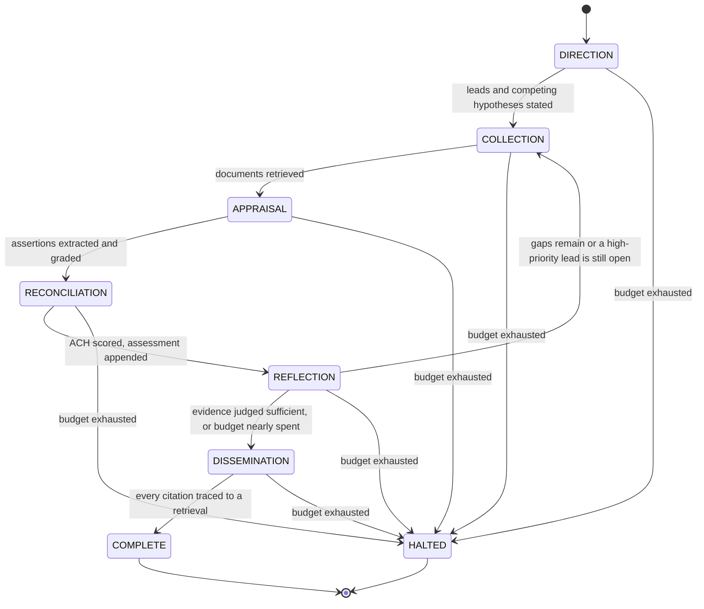
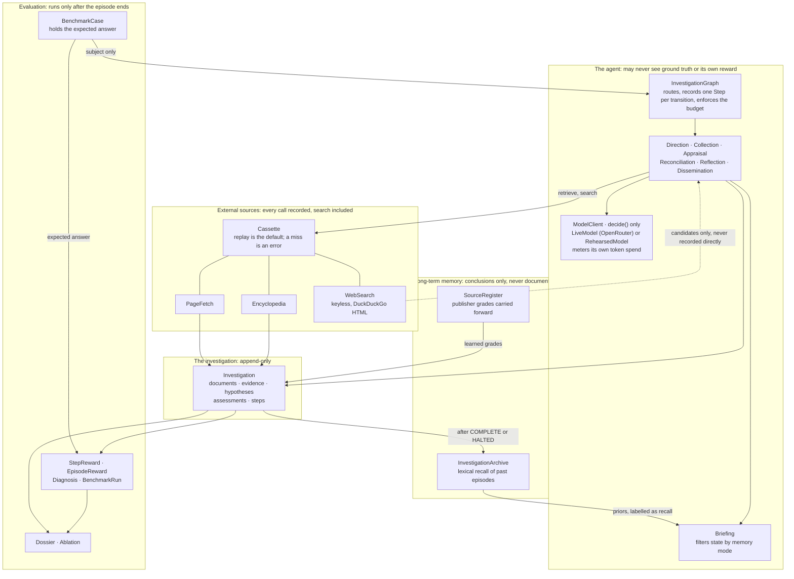

# Architecture

## The state machine

Six phases of the intelligence cycle, plus two terminal states. I record one `Step` per transition,
and that record is the only source of truth I trust for any metric. Nothing gets reported from
memory.

That loop back from **Reflection** to **Collection** is what actually makes the investigation
adaptive. New leads found while reading send it out again, and it simply can't converge while a
high-priority question is still open. That's the whole trick.

I added `HALTED` so a non-converging investigation ends visibly instead of just hanging. The halt
gets recorded as its own step, and a halted episode still stays in the benchmark denominator, tagged
with why it failed. No quietly dropping the bad runs.

## What flows where

Three boundaries in that picture aren't just convention. I built them in on purpose, and enforced
them:

**Ground truth stops at the evaluation box.** `BenchmarkCase` only ever sends its `subject` into the
agent. `Investigator.investigate()` has no overload anywhere that takes a case, so the object holding
the expected answer physically can't cross over.

**Reward flows one way.** Nothing inside the agent imports anything from `bench`. Scoring reads the
finished investigation after the fact. The agent itself never reads its own score.

**Memory carries conclusions, never documents.** The archive stores a digest with no URL anywhere in
it, so anything recalled is structurally incapable of turning into a citation later.

## Where each requirement lives

| Requirement from the brief | Where it is implemented |
| --- | --- |
| Investigate a company, person, or claim | `domain/subject.py`, one mechanism, polymorphic seeds |
| Gather from multiple external sources | `sources/tools.py`: encyclopedia, page fetch, keyless web search, all cassette-recorded |
| Plan and adapt as new information appears | `graph/phases.py`, `Reflection` reopens `Collection` |
| Evaluate evidence and source reliability | Admiralty grading in `domain/provenance.py` |
| Handle conflicting or insufficient information | ACH in `domain/analysis.py`; the sufficiency override in `Reconciliation` |
| Short-term and long-term memory | `graph/briefing.py` (in-episode), `memory/archive.py` (across episodes) |
| Reflect before concluding | `Reflection` phase |
| Structured report with citations and confidence | `report/dossier.py` |
| Maintain logs of the process | `Step`, appended once per transition, never mutated |
| Evaluate across multiple cases | `bench/`, `benchmark/cases.json`, `report/ablation.py` |

## Invariants, and what actually enforces each

Two of these come from the type system. The rest are enforced by code sitting at a named boundary.
I've kept that distinction visible on purpose instead of blurring both under one heading, because
they fail differently if something regresses.

- **Type system:** an `Investigation` cannot be constructed or deserialised holding a citation with
  no retrieved document behind it, nor without a baseline assessment (`@model_validator`).
- **Type system:** `Document`, `Evidence`, `Assessment` and `Step` are frozen, so the record of
  what was found and concluded cannot be edited after the fact.
- **Code, at `record_evidence`:** evidence cannot be added against a document never retrieved.
- **Code, at the Direction transition:** fewer than two competing hypotheses falls back to the
  subject's own, because a single-hypothesis investigation is confirmation bias by construction.
- **Code, at Dissemination:** no report is written while any citation, or any link in the
  narrative, lacks a document behind it.
- **Code, at Reconciliation:** a conclusive verdict is overridden to insufficient evidence when the
  gathered weight cannot carry it.
- **Code, at the sweep boundary:** long-term memory is cleared before a sweep, so a run is
  reproducible from `(case id, memory mode, cassette)`. I verified this by running `ablate` twice
  and comparing the output.
- **Code, at `Investigator.investigate()`:** a model failure mid-episode (a real possibility once
  the live path runs against an actual network) halts the investigation, with the failure recorded
  as its own step, instead of raising and taking the rest of a benchmark sweep down with it. The
  graph engine itself still doesn't catch a node's own exception, that boundary hasn't moved, this
  sits one layer further out.
