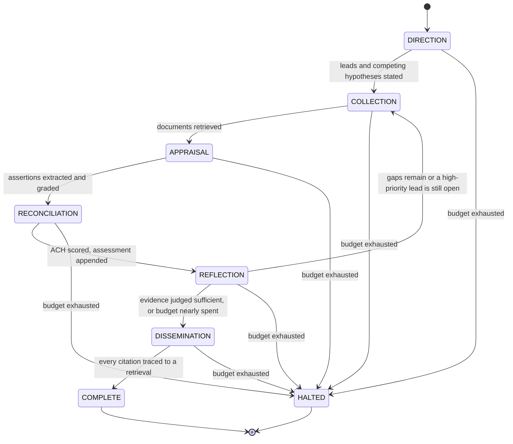
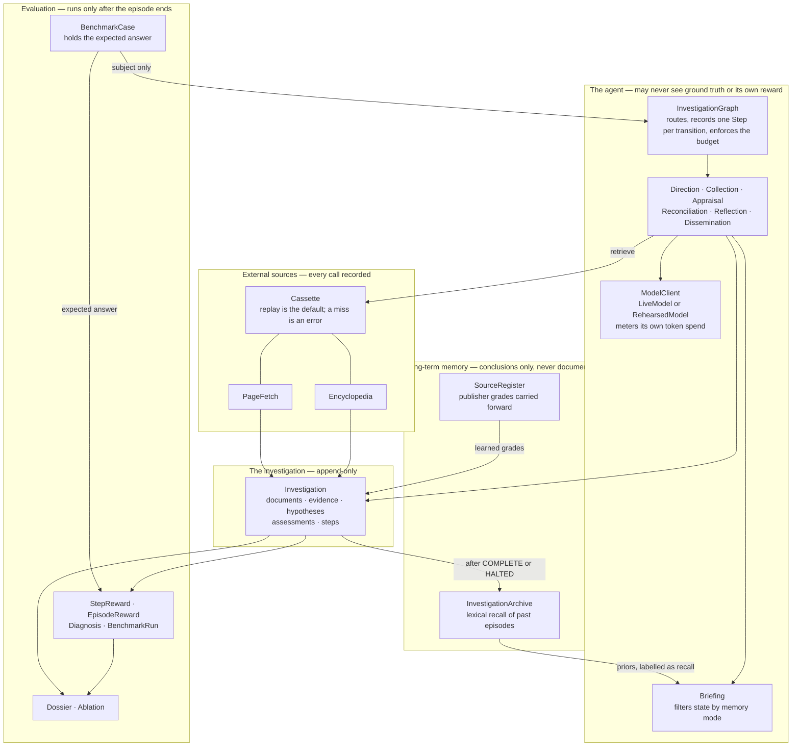

# Architecture

## The state machine

Six phases of the intelligence cycle, plus two terminal states. One `Step` is recorded per
transition, and that record is the sole source of truth for every metric.

The loop back from **Reflection** to **Collection** is what makes the investigation adaptive: new
leads discovered while reading send it out again, and it cannot converge while a high-priority
question is still open.

`HALTED` exists so a non-converging investigation ends visibly rather than silently. The halt is
itself recorded as a step, and a halted episode stays in the benchmark denominator with a failure
tag.

## What flows where

Three boundaries in that picture are deliberate and enforced, not conventional:

**Ground truth stops at the evaluation box.** `BenchmarkCase` sends only its `subject` into the
agent. `Investigator.investigate()` has no overload that accepts a case, so the object holding the
expected answer cannot cross.

**Reward flows one way.** Nothing inside the agent imports anything from `bench`. Scoring reads the
finished investigation; the agent never reads the score.

**Memory carries conclusions, not documents.** The archive stores a digest with no URL in it, so
recalled material is structurally incapable of becoming a citation.

## Where each requirement lives

| Requirement from the brief | Where it is implemented |
| --- | --- |
| Investigate a company, person, or claim | `domain/subject.py` — one mechanism, polymorphic seeds |
| Gather from multiple external sources | `sources/tools.py`, plus server-side search in `model/live.py` |
| Plan and adapt as new information appears | `graph/phases.py` — `Reflection` reopens `Collection` |
| Evaluate evidence and source reliability | Admiralty grading in `domain/provenance.py` |
| Handle conflicting or insufficient information | ACH in `domain/analysis.py`; the sufficiency override in `Reconciliation` |
| Short-term and long-term memory | `graph/briefing.py` (in-episode), `memory/archive.py` (across episodes) |
| Reflect before concluding | `Reflection` phase |
| Structured report with citations and confidence | `report/dossier.py` |
| Maintain logs of the process | `Step`, appended once per transition, never mutated |
| Evaluate across multiple cases | `bench/`, `benchmark/cases.json`, `report/ablation.py` |

## Invariants the type system enforces

- Evidence cannot be recorded against a document the episode never retrieved.
- Assessments and steps are append-only, so confidence progression and convergence survive.
- An investigation holds at least two competing hypotheses once Direction has run.
- A report is not written at all while any citation lacks a document behind it.
- A conclusive verdict is overridden to insufficient evidence when the evidence cannot carry it.
- Every run is reproducible from `(case id, memory mode, cassette)`.
